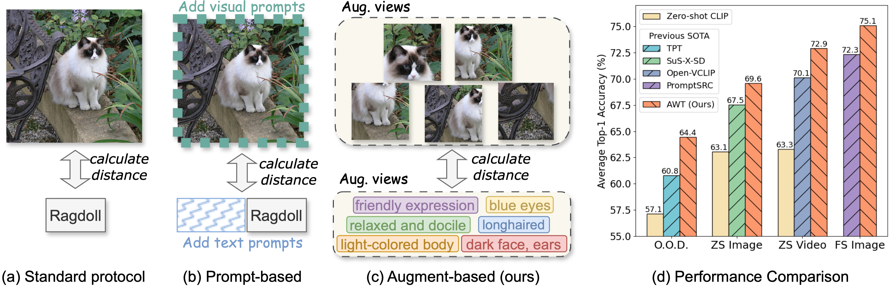

# AWT: Transferring Vision-Language Models via Augmentation, Weighting, and Transportation

✨ Welcome to the official repository for "AWT: Transferring Vision-Language Models via Augmentation, Weighting, and Transportation". This work is a collaborative effort by [Yuhan Zhu](https://scholar.google.com/citations?user=ydgR3LgAAAAJ&hl=en), Yuyang Ji, [Zhiyu Zhao](https://scholar.google.com/citations?user=2Ef8Y0IAAAAJ&hl=en), [Gangshan Wu](https://mcg.nju.edu.cn/member/gswu/en/index.html), and [Limin Wang](https://wanglimin.github.io/) from Nanjing University and Shanghai AI Lab.

🔗 Read our paper: [ArXiv](https://arxiv.org/abs/2407.04603) | [NeurIPS 2024](https://neurips.cc/virtual/2024/poster/94677)

## Overview

🚀 Our work presents AWT, a novel framework designed to adapt pre-trained Vision-Language Models, enhancing their zero-shot capabilities without additional training. AWT can also facilitate few-shot learning when integrated with a multimodal adapter. It achieves state-of-the-art performance across both zero-shot and few-shot image and video classification tasks.



## 🗂 Contents

- [Installation](#installation)
- [Data Preparation](#data-preparation)
- [Using AWT](#using-awt)
  - [Zero-shot Image Classification](#zero-shot-image-classification)
  - [Out-of-Distribution Generalization](#out-of-distribution-generalization)
  - [Few-shot Image Classification](#few-shot-image-classification)
  - [Zero-shot Video Action Recognition](#zero-shot-video-action-recognition)
- [Generate Descriptions](#generate-descriptions)
- [Experiment with Other VLMs](#experiment-with-other-vlms)
- [Citation](#citation)
- [Acknowledgements](#acknowledgements)

## Installation
```bash
# Create a conda environment
conda create -y -n awt python=3.8
conda activate awt

# Require pytorch>=1.10
conda install pytorch==2.0.0 torchvision==0.15.0 torchaudio==2.0.0 pytorch-cuda=11.8 -c pytorch -c nvidia

# Install other dependencies 
pip install -r requirements.txt

# If running few-shot experiments
cd AWT_few_shot/Dassl.pytorch ; python setup.py develop
```

## Data Preparation
Refer to the following guides for setting up datasets:
- Image datasets: [CoOp](https://github.com/KaiyangZhou/CoOp/blob/main/DATASETS.md) and [SuS-X](https://github.com/vishaal27/SuS-X/blob/main/data/DATA.md)
- Video datasets: [Open-VCLIP](https://github.com/wengzejia1/Open-VCLIP)

## Using AWT

### Zero-shot Image Classification
```bash
cd AWT_zero_shot

# Set data path in `./scripts/pre_extract.sh`

# `dataset_name` is chosen from ['imagenet', , 'oxford_flowers', 'dtd', 'oxford_pets', 'stanford_cars', 'ucf101', 'caltech101', 'food101', 'sun397', 'fgvc_aircraft', 'eurosat', 'caltech256', 'cub', 'birdsnap']

# Step 1: Extract visual features
bash ./scripts/pre_extract.sh [dataset_name]

# Step 2: Evaluate AWT performance
bash ./scripts/evaluate.sh [dataset_name]
```

### Out-of-Distribution Generalization
Note that ImageNet-v2 and ImageNet-A share the same description file as ImageNet, as they have a similar visual style. 
```bash
cd AWT_zero_shot

# `dataset_name` is chosen from ['imagenet_a', 'imagenet_sketch', 'imagenet_r', 'imagenetv2']

# Step 1: Extract visual features
./scripts/pre_extract.sh [dataset_name]

# Step 2: Evaluate AWT performance
bash ./scripts/evaluate.sh [dataset_name]
```

### Few-shot Image Classification
```bash
cd AWT_few_shot/MM_Adapter
```
We use one NVIDIA A100-SXM4-80GB GPU for training. If you encounter an OOM error on your hardware, please reduce the `Desc_Per_Batch` value in `./configs/trainers/AWT/[config_you_use].yaml` (note that this might slightly decrease performance).
```bash
# `dataset_name` are defined in `./configs/datasets/`

# For 1, 2, or 4 shots training
bash scripts/awt/main.sh [dataset_name] vit_b16_1_2_4_shot [n_shot]

# For 8 or 16 shots training
bash scripts/awt/main.sh [dataset_name] vit_b16_8_16_shot [n_shot]
```
To evaluate the model:
```bash
bash scripts/awt/test.sh [dataset_name] [config_you_use] [n_shot]
```
Compute the mean and variance across different seeds:
```bash
python parse_test_res.py [experiment path] --test-log
```
Draw few-shot performance curves (refer to our Figure 3):
```bash
python draw_curves.py
```
### Zero-shot Video Action Recognition

In this task, we treat the sampled video frames as augmented views in AWT. Specifically, we use `8x3x4` views (#frames x #crops x #clips).

To reproduce our results:
- Use the [pre-trained Open-VCLIP](https://github.com/wengzejia1/Open-VCLIP) to extract features of each video. Save the features and ground-truth labels to disk, following the format in `AWT_zero_shot/pre_extract.py`.
- Use `AWT_zero_shot/evaluate.py` to read the saved features and labels, then obtain the benchmark accuracy. Class descriptions for the three video datasets can be found in `AWT_zero_shot/descriptions/video_datasets/`.

## Generate Descriptions

We take a two-step dataset-aware prompt strategy to generate descriptions for each class.

```bash
cd description_generation

# Step 1: Generate queries
# Add `--no_dataset_desc` to use AWT-base, i.e., w/o dataset descriptions
python gen_questions.py

# Step 2: Generate class descriptions
python gen_descriptions.py
```

## Experiment with Other VLMs
```bash
cd AWT_zero_shot

# run AWT on ALIGN
bash scripts/run_align.sh [dataset_name]

# run AWT on EVA02-CLIP
bash scripts/run_eva02_clip.sh [dataset_name]

# run AWT on SigLIP
bash scripts/run_siglip.sh [dataset_name]
```

## Citation

🤗 If you find our code useful or our work relevant, please consider citing:

```
@article{awt2024,
  title={AWT: Transferring Vision-Language Models via Augmentation, Weighting, and Transportation},
  author={Zhu, Yuhan and Ji, Yuyang and Zhao, Zhiyu and Wu, Gangshan and Wang, Limin},
  journal={arXiv preprint arXiv:2407.04603},
  year={2024}
}
```

## Acknowledgements

Our work builds upon [CoOp](https://github.com/KaiyangZhou/CoOp), [PLOT](https://github.com/CHENGY12/PLOT), [TPT](https://github.com/azshue/TPT), [Dassl](https://github.com/KaiyangZhou/Dassl.pytorch), and [Open-VCLIP](https://github.com/wengzejia1/Open-VCLIP). Thanks for their excellent work and open-source contributions.